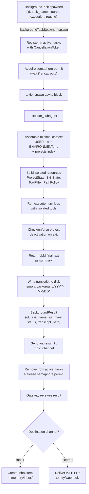

# Background Tasks Module

Manages spawning, execution, and result delivery of background tasks—SubAgents, pulse evaluations, and scheduled actions—without blocking the main agent.

## Overview

The background module decouples background work (pulse evaluation, scheduled action execution, subagent delegation) from the main agent's turn loop. This solves three problems:

1. **Pulse/scheduled actions don't block conversation.** Background tasks run on separate Tokio tasks, managed by a bounded semaphore, so the main agent stays responsive.
2. **User can steer mid-turn.** While a long multi-tool sequence runs, background results and user messages can be injected between tool iterations without waiting for the turn to complete.
3. **Fire-and-forget subagents.** The main agent can spawn a self-contained task (via the `subagent_spawn` tool) and continue its conversation while the worker runs asynchronously.

The module owns:
- **Task lifecycle management:** spawning, concurrency control (semaphore), cancellation tokens, transcript persistence.
- **Execution:** SubAgent (LLM-powered turn loop with isolated resources).
- **Resource isolation:** each background task gets its own `ProjectState`, `SkillState`, `ToolFilter`, and `PathPolicy` so they don't interfere with each other or the main agent.
- **Context assembly for SubAgents:** minimal system prompt (USER.md + ENVIRONMENT.md + projects index + task prompt + optional presets), excluding SOUL.md and observation logs.
- **Result routing:** formatting `BackgroundResult` for injection into the main agent's message stream or direct delivery to notification channels.

The module does **not** handle:
- **Notification routing/delivery.** The gateway publishes results to bus topics; notify subscribers deliver to channels.
- **Preset discovery or validation.** The `subagent_spawn` tool (in `tools/background.rs`) loads and validates presets; this module just receives preset metadata if provided.
- **Interrupt channel mechanics.** The gateway owns the interrupt channel; the spawner just sends results through it.
- **Model tier fallback logic.** The `SpawnContext` resolves tier → provider spec (with fallback: small → medium → large → main agent model).

## How It Works

### Core Abstractions

**BackgroundTask:** The envelope for any background work. Contains:
- `id`: Unique identifier (e.g., `"agent-XXXXXXXX-timestamp"`)
- `task_name`: Human-readable name for logging and display
- `source`: Where the task came from (`TaskSource::Agent`, `::Pulse`, `::Action`)
- `execution`: What to run (`Execution::SubAgent`)
- `routing`: How to deliver the result (`ResultRouting::Direct` with explicit channel names)

**Execution:**
- `SubAgent(SubAgentConfig)`: Runs a simplified agent turn loop with minimal context. The SubAgent gets isolated clones of `ProjectState`, `SkillState`, `ToolFilter`, and `PathPolicy`, so it operates independently of the main agent and other SubAgents. Returns the LLM's final text response as the summary.

**BackgroundTaskSpawner:** Manages all background task lifecycles:
- Bounded concurrency: a semaphore (default: 3) caps concurrent tasks.
- Spawn on Tokio: each task runs as `tokio::spawn(async move {})`.
- Cancellation: every task has a `CancellationToken`; cancelling stops the task and cleans up active projects.
- Transcript persistence: output written to `memory/background/YYYY-MM/DD/bg-{id}.log`.
- Result channel: on completion, sends `BackgroundResult` to the result channel.

### Primary Data Flow

#### Task Spawning

```
BackgroundTask {
    id, task_name, source, execution, routing
}
    ↓
BackgroundTaskSpawner::spawn()
    ├─ Register in active_tasks (with CancellationToken)
    ├─ Acquire semaphore permit (waits if at capacity)
    └─ tokio::spawn(async move {
         execute_subagent() → minimal context + turn loop
         → BackgroundResult { id, summary, status, transcript_path }
         → send to result_tx (mpsc channel)
       })
    ↓
BackgroundResult flows to gateway via mpsc channel
```

#### SubAgent Execution

When `execute_subagent()` runs:

1. **Assemble minimal context:** Build system prompt from:
   - `ENVIRONMENT.md` (e.g., available tools)
   - `USER.md` (preferences, timezone)
   - Projects index (available projects)
   - Preset instructions (if any, from `subagent_spawn` tool parameter)
   - Explicit context passed in `SubAgentConfig`

2. **Create isolated resources:** Cloned from main agent state but independent:
   - `ProjectState`: clone of project index, but own active project state
   - `SkillState`: clone of skill index, no active skills
   - `ToolFilter`: fresh, with gated tools (e.g., `exec`) and preset restrictions applied
   - `PathPolicy`: fresh, rooted at workspace root
   - `ToolRegistry`: built with above isolated state

3. **Run turn loop:** Call `execute_turn()` with the minimal context and isolated resources.
   - If a project is active at the end, call `ensure_project_deactivated()` to prompt the SubAgent one more time to deactivate cleanly.
   - If the retry also fails to deactivate, force-deactivate manually with an auto-generated log: `"[auto] SubAgent {id} completed without deactivating."`
   - Return the LLM's final text response.

4. **Handle cancellation:** If cancelled mid-turn, `tokio::select! { () = token.cancelled() }` triggers cleanup:
   - Deactivate any active project with log: `"[cancelled] SubAgent {id} was stopped."`
   - Decrement MCP server ref counts.
   - Clear tool filter state.

#### Result Routing

`BackgroundResult` carries the completion envelope:
- `id`: Task ID
- `task_name`: Human-readable task name
- `summary`: SubAgent's final text response
- `transcript_path`: Path to disk log
- `status`: `Completed`, `Cancelled`, or `Failed { error: String }`
- `routing`: How to deliver it

The gateway receives the result and routes to the channels listed in `ResultRouting::Direct`. Channels are specified at task creation time (e.g., by the pulse definition's `channels` field, or by the `subagent_spawn` tool).

Results routed to `inbox` become inbox items. External channel results (ntfy, webhook) are delivered via HTTP.

### Resource Isolation

Each SubAgent gets its own copies of mutable state:

| Resource | Shared? | Why |
|----------|---------|-----|
| `ProjectState` | ❌ Cloned | Each SubAgent has independent active project |
| `SkillState` | ❌ Cloned | Each SubAgent starts with no active skills |
| `ToolFilter` | ❌ Fresh | Each SubAgent has its own tool restrictions |
| `PathPolicy` | ❌ Fresh | Each SubAgent has its own project write scope |
| `McpRegistry` | ✅ Shared (Arc) | MCP servers are shared; ref counting handles multiple activations of same project |
| `ToolRegistry` | ❌ Fresh | Built from isolated state above |

This isolation ensures:
- Multiple SubAgents can work independently without interfering with each other's tool state or project activation.
- The main agent's state is never modified by background tasks.
- Concurrent access to the same project is safe (filesystem is the concurrency model).

### Concurrency and Cancellation

**Semaphore-bounded execution:** The spawner maintains an `Arc<Semaphore>` (default capacity: 3). Every spawned task acquires a permit before executing and releases it when done (or dropped). This prevents unbounded task accumulation.

**Cancellation tokens:** Every task has a `CancellationToken`. The spawner stores tokens in `active_tasks` (HashMap). When `cancel(task_id)` is called, the SubAgent checks the token between tool iterations in the turn loop. On cancel, active project is deactivated with log.

**No blocking or locking:** Cancellation is non-blocking. Checking a `CancellationToken` is just a flag read. Task lifecycle (spawn, cancel, cleanup) uses async-safe primitives (`tokio::sync::Mutex`, channels).

---

## Design Decisions

**Decision: Semaphore-bounded concurrency, not task queuing.**

**Why:** Unbounded queuing delays all pending tasks when one slow task holds a permit. A semaphore ensures fairness: up to N tasks run in parallel, others block on the permit, first to finish releases first. This is simpler than a priority queue and matches the "no priority" constraint (all tasks compete equally for slots).

---

**Decision: SubAgent isolation via resource cloning, not ref-counting locks.**

**Why:** Each SubAgent gets its own clones of `ProjectState`, `SkillState`, `ToolFilter`, and `PathPolicy` because these represent mutable state (active projects, active skills, enabled tools). Sharing them behind locks would serialize tool execution across SubAgents and the main agent. Cloning them is cheap (the indices are small) and eliminates contention. MCP servers are shared (started once, ref-counted) because they're expensive resources.

---

**Decision: Mandatory project deactivation with auto-log fallback.**

**Why:** Projects depend on clean session logs for continuity. If a SubAgent forgets to deactivate, the ref count stays high and MCP servers don't tear down. The deactivation retry enforces correct behavior via prompt. The auto-log is a safety net, not the intended path, but ensures the project is always left in a consistent state even if the SubAgent misbehaves.

---

**Decision: Transcript written asynchronously after task completes.**

**Why:** Writing happens in the spawned task before returning the result, not on the critical path. The transcript path is included in `BackgroundResult` so the gateway/router can reference it.

---

**Decision: Cancellation is cooperative.**

**Why:** SubAgent cancellation is checked between tool iterations, so the worst-case latency is one LLM round-trip. Forced cleanup happens on cancel (project deactivation).

---

**Decision: No sub-to-sub delegation (SubAgents cannot spawn SubAgents).**

**Why:** Orchestration chains are a complexity nightmare. If the main agent needs to delegate a task that requires decomposition, it spawns multiple SubAgents itself. This keeps the dependency tree flat and reasoning about failure modes tractable.

---

## Dependencies

### Depends On

- **`crate::config`** — `BackgroundConfig` (max_concurrent, model tiers), `BackgroundModelTier` (Small/Medium/Large), `ProviderSpec`, `ModelSpec`. Used to configure concurrency limits and resolve model tiers to concrete providers.

- **`crate::models`** — `ModelProvider`, `CompletionOptions`, `SharedHttpClient`, `Message`. Used to build and call LLM providers for SubAgent execution.

- **`crate::models::retry`** — `RetryConfig`. Passed to provider construction; configures API call retry behavior.

- **`crate::agent::context`** — Context building functions (`build_subagent_system_content`), `PromptContext`, `MemoryContext`, `SubagentsContext`. Used to assemble the minimal system prompt for SubAgents.

- **`crate::agent::turn`** — `execute_turn()`. The SubAgent executor calls this to run the isolated turn loop.

- **`crate::agent::recent_messages`** — `RecentMessages`. Holds the message history for SubAgent turns.

- **`crate::agent::interrupt`** — `dead_interrupt_rx()`. Provides a dummy interrupt channel (SubAgents don't respond to mid-turn interrupts; they run to completion).

- **`crate::mcp`** — `SharedMcpRegistry`. Passed to SubAgent resources; used for project-scoped MCP server lifecycle (activate/deactivate).

- **`crate::projects::activation`** — `ProjectState`, `SharedProjectState`. Each SubAgent gets an isolated clone; used to manage active projects.

- **`crate::skills`** — `SkillState`, `SharedSkillState`. Each SubAgent gets an isolated clone; used to manage active skills.

- **`crate::tools`** — `ToolRegistry`, `ToolFilter`, `PathPolicy`, `FileTracker`. SubAgents get fresh isolated instances of tool-related state.

- **`crate::workspace`** — `IdentityFiles` (SOUL.md, USER.md, ENVIRONMENT.md), `WorkspaceLayout` (paths to directories). Used for context assembly.

- **`crate::notify::types`** — `TaskSource` (Agent, Pulse, Action). Labels where a task originated.

- **`crate::subagents`** — `SubagentPresetFrontmatter` (tool restrictions, model tier, channels). Optional preset metadata passed to `build_spawn_resources()`.

- **`tokio`** — `tokio::sync::{Mutex, Semaphore, mpsc}`, `tokio_util::sync::CancellationToken`. Core async primitives for task spawning, concurrency control, and cancellation.

- **`anyhow`** — Error handling throughout.

- **`chrono`** — Timestamps in `BackgroundResult`, task started times in `ActiveTaskInfo`.

- **`serde_json`, `serde`** — Serialization in `ToolDefinition` (for tools/background.rs tools).

### Used By

- **`src/gateway/server/mod.rs`** — The main gateway owns the `BackgroundTaskSpawner` and `mpsc` result channel. Creates spawn context, handles background results, routes to channels, manages interrupt flow.

- **`src/gateway/server/spawn_helpers.rs`** — `build_spawn_resources()` function. Used by gateway and `subagent_spawn` tool to construct isolated SubAgentResources.

- **`src/gateway/server/startup.rs`** — Initializes the spawner, result channel, and spawn context during gateway startup.

- **`src/gateway/server/actions.rs`** — Spawns scheduled action background tasks (SubAgent).

- **`src/pulse/executor.rs`** — Spawns pulse evaluation background tasks (SubAgent execution).

- **`src/tools/background.rs`** — Three tools:
  - `stop_agent`: cancels a running task via spawner.
  - `list_agents`: lists active tasks via spawner.
  - `subagent_spawn`: spawns new background tasks on demand (both sync and async modes).

- **`src/agent/turn.rs`** — The SubAgent executor calls `execute_turn()` from here.

- **`src/memory/observer/prompt.rs`, `src/memory/reflector/prompt.rs`** — Reference background task types and formatting for observation prompts.

---

## Module Organization

| File | Purpose |
|------|---------|
| `mod.rs` | Module exports: re-exports public types and the `BackgroundTaskSpawner`. |
| `types.rs` | Core types: `BackgroundTask`, `BackgroundResult`, `TaskStatus`, `Execution` (SubAgent config), `ResultRouting`, `ActiveTaskInfo`. Helper function `execution_info()` and `format_background_result()` for display. |
| `spawner.rs` | `BackgroundTaskSpawner`: lifecycle management, semaphore concurrency control, cancellation, active task tracking, result channel sending, transcript writing. |
| `subagent.rs` | SubAgent execution: `SubAgentResources` (isolated state bundle), `build_resources()` (construct resources from main agent state), `execute_subagent()` (run turn loop), project deactivation enforcement. |
| `spawn_context.rs` | `SpawnContext` (gathered at gateway startup): config, provider specs, identity, options, workspace layout. `build_spawn_resources()` resolves model tier and constructs SubAgentResources for a specific task. |

---

## Data Flow Diagram


