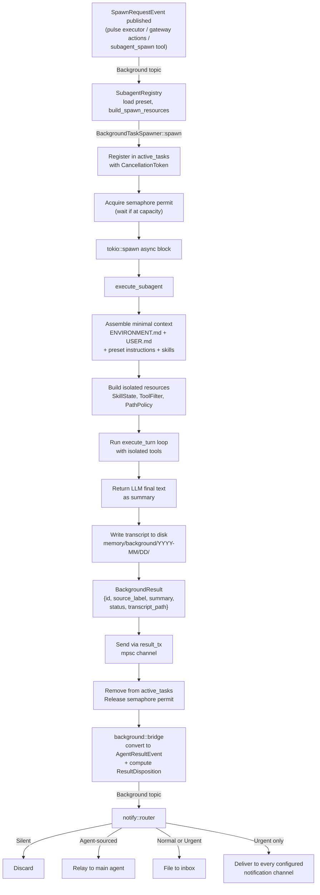

# Background Tasks Module

Manages spawning, execution, and result delivery of background tasks—SubAgents, pulse evaluations, and scheduled actions—without blocking the main agent.

## Overview

The background module decouples background work (pulse evaluation, scheduled action execution, subagent delegation) from the main agent's turn loop. This solves three problems:

1. **Pulse/scheduled actions don't block conversation.** Background tasks run on separate Tokio tasks, managed by a bounded semaphore, so the main agent stays responsive.
2. **User can steer mid-turn.** While a long multi-tool sequence runs, background results and user messages can be injected between tool iterations without waiting for the turn to complete.
3. **Fire-and-forget subagents.** The main agent can spawn a self-contained task (via the `subagent_spawn` tool) and continue its conversation while the worker runs asynchronously.

The module owns:
- **Task lifecycle management:** spawning, concurrency control (semaphore), cancellation tokens, transcript persistence.
- **SubAgent execution:** LLM-powered turn loop with isolated resources.
- **Resource isolation:** each background task gets its own `SkillState`, `ToolFilter`, and `PathPolicy` so they don't interfere with each other or the main agent.
- **Context assembly for SubAgents:** minimal system prompt (`ENVIRONMENT.md` + `USER.md` + preset instructions + skills index, plus `SOUL.md`/`AGENTS.md`/`MEMORY.md` when the preset opts in) followed by the task prompt, excluding observation logs.
- **Result-to-event conversion:** the `bridge` submodule turns a completed `BackgroundResult` into an `AgentResultEvent`, computing its `ResultDisposition` from sentinel strings in the SubAgent's summary, and publishes it on the bus.

The module does **not** handle:
- **Channel delivery.** This module publishes each result's `AgentResultEvent` to the bus; the `notify` module's router decides the concrete destinations (inbox, external notification channels, or the main agent) and delivers to them.
- **Preset discovery or validation.** The `subagent_spawn` tool (in `tools/background.rs`) and the `SubagentRegistry` (`src/subagents/registry.rs`) load and validate presets via `SubagentPresetIndex`; this module just receives already-resolved preset frontmatter/body if provided.
- **Interrupt channel mechanics.** The main agent owns its own mid-turn interrupt channel; a completed background result only reaches it indirectly, via the bus and the notification router.
- **Model tier fallback logic.** The `SpawnContext` resolves tier → provider spec (with fallback: small → medium → large → main agent model).

## How It Works

### Core Abstractions

**BackgroundTask:** The envelope for any background work. Contains:
- `id`: Unique identifier (e.g., `"agent-XXXXXXXX-timestamp"`)
- `source_label`: Human-readable label for logging and display (e.g. `"pulse:email_check"`, `"action:deploy"`)
- `source`: Where the task came from (`EventTrigger::Agent`, `::Pulse`, `::Action`, `::Webhook(name)`)
- `subagent_config`: `SubAgentConfig` (prompt, context, model tier)
- `agent_preset`: The subagent preset that runs the task (`PresetName`)

**SubAgentConfig:** Drives a simplified agent turn loop with minimal context. The SubAgent gets an isolated clone of `SkillState` plus a fresh `ToolFilter` and `PathPolicy`, so it operates independently of the main agent and other SubAgents. Returns the LLM's final text response as the summary, along with the full message transcript.

**BackgroundTaskSpawner:** Manages all background task lifecycles:
- Bounded concurrency: a semaphore (default: 3) caps concurrent tasks.
- Spawn on Tokio: each task runs as `tokio::spawn(async move {})`.
- Cancellation: every task has a `CancellationToken`; cancelling it preempts the in-flight execution immediately — no per-task cleanup is needed, since a SubAgent's resources belong to that task alone.
- Transcript persistence: output written to `memory/background/YYYY-MM/DD/bg-{id}.log`.
- Result channel: on completion, sends `BackgroundResult` to the result channel. `send_result()` also lets a caller inject a pre-built `BackgroundResult` directly, without running a SubAgent turn.

### Primary Data Flow

#### Task Spawning

```
SpawnRequestEvent { preset, source_label, prompt, context, source, model_tier_override }
    ↓ published on the bus Background topic by the pulse executor,
      gateway action spawning, or the subagent_spawn tool
SubagentRegistry (src/subagents/registry.rs)
    ├─ Scan SubagentPresetIndex, load the named preset (falls back to general-purpose on error)
    ├─ build_spawn_resources() → provider + isolated SubAgentResources for the resolved tier
    └─ BackgroundTaskSpawner::spawn(BackgroundTask, Some(resources))
         ├─ Register in active_tasks (with CancellationToken)
         ├─ Acquire semaphore permit (waits if at capacity)
         └─ tokio::spawn(async move {
              race: token.cancelled() vs execute_subagent()
              → BackgroundResult { id, source_label, source, summary, status, transcript_path, timestamp, agent_preset }
              → send to result_tx (mpsc channel)
            })
    ↓
BackgroundResult flows to background::bridge via mpsc channel
```

A pulse or scheduled action with `agent = "main"` never enters this module at all — it's returned as a main-agent wake turn and injected directly into the main agent's next turn.

#### SubAgent Execution

When `execute_subagent()` runs:

1. **Assemble minimal context:** `build_subagent_system_content()` builds, in order:
   - `AGENT_INSTRUCTIONS` (preset instructions, if any)
   - `SOUL.md` / `AGENTS.md` (only if the preset opts in via `include_identity`)
   - `ENVIRONMENT.md`
   - `USER.md`
   - `MEMORY.md` (only if `include_identity`)
   - `SKILLS_INDEX` (the SubAgent's own skill index)
   - `ACTIVE_SKILLS` (active skill instructions, if any)

   This is joined with the explicit context passed in `SubAgentConfig` and the task prompt into a single user message.

2. **Create isolated resources** (`build_subagent_resources()`): cloned from main agent state but independent:
   - `SkillState`: clone of the skill index, no active skills
   - `PathPolicy`: fresh, with no blocked paths
   - `ToolFilter`: fresh; an allow-only or denied set is applied when the preset's frontmatter specifies one, otherwise unrestricted
   - `FileTracker`: fresh, tracks reads within this SubAgent turn only
   - `ToolRegistry`: built from the isolated state above
   - `McpRegistry`: shared with the main agent, not cloned

3. **Run turn loop:** Call `execute_turn()` with the minimal context and isolated resources. The mid-turn interrupt receiver is a dead channel (`dead_interrupt_rx()`), since SubAgents run to completion without being interrupted. Return the last assistant message as the summary, plus the full message transcript.

4. **Handle cancellation:** `BackgroundTaskSpawner::spawn()` races `token.cancelled()` against the `execute_subagent()` future in a `tokio::select!` (cancellation checked first). If the token fires first, the in-flight future is dropped and a `Cancelled` `BackgroundResult` (empty summary, no transcript) is produced immediately.

#### Result Routing

`BackgroundResult` carries the completion envelope:
- `id`: Task ID
- `source_label`: Human-readable source label
- `source`: `EventTrigger` the task originated from
- `summary`: SubAgent's final text response
- `transcript_path`: Path to disk log
- `status`: `Completed`, `Cancelled`, or `Failed { error: String }`
- `timestamp`: When the task completed
- `agent_preset`: The preset that ran it

`background::bridge::spawn_result_bridge` reads each `BackgroundResult` off the spawner's result channel and converts it into an `AgentResultEvent`, computing a `ResultDisposition` from sentinel strings the SubAgent leaves in its own summary:
- `HEARTBEAT_OK` on a pulse result → `Silent` (nothing worth surfacing)
- `HEARTBEAT_URGENT` anywhere in the summary → `Urgent`
- otherwise → `Normal`

The event is published on the bus `Background` topic. The notification router (`notify::router`) subscribes and routes it: `Silent` results are discarded; agent-spawned results are relayed back to the main agent; everything else is filed to the inbox, plus pushed to every configured notification channel when `Urgent`.

### Resource Isolation

Each SubAgent gets its own copies of mutable state:

| Resource | Shared? | Why |
|----------|---------|-----|
| `SkillState` | ❌ Cloned | Each SubAgent starts with no active skills |
| `ToolFilter` | ❌ Fresh | Each SubAgent has its own tool restrictions |
| `PathPolicy` | ❌ Fresh | Each SubAgent has its own blocked-path set (empty by default) |
| `McpRegistry` | ✅ Shared (Arc) | MCP servers are started once at gateway startup; SubAgents read the same flat server list |
| `ToolRegistry` | ❌ Fresh | Built from isolated state above |

This isolation ensures:
- Multiple SubAgents can work independently without interfering with each other's tool state.
- The main agent's state is never modified by background tasks.

### Concurrency and Cancellation

**Semaphore-bounded execution:** The spawner maintains an `Arc<Semaphore>` (default capacity: 3). Every spawned task acquires a permit before executing and releases it when done (or dropped). This prevents unbounded task accumulation.

**Cancellation tokens:** Every task has a `CancellationToken`. The spawner stores tokens in `active_tasks` (HashMap). Calling `cancel(task_id)` just flips the token — a non-blocking flag read on the other side. The spawned task's `tokio::select!` (biased toward the cancellation branch) picks that up and drops the in-flight `execute_subagent()` future immediately.

**No blocking or locking:** Cancellation is non-blocking. Checking a `CancellationToken` is just a flag read. Task lifecycle (spawn, cancel, cleanup) uses async-safe primitives (`tokio::sync::Mutex`, channels).

---

## Design Decisions

**Decision: Semaphore-bounded concurrency, not task queuing.**

**Why:** Unbounded queuing delays all pending tasks when one slow task holds a permit. A semaphore ensures fairness: up to N tasks run in parallel, others block on the permit, first to finish releases first. This is simpler than a priority queue and matches the "no priority" constraint (all tasks compete equally for slots).

---

**Decision: SubAgent isolation via resource cloning, not ref-counting locks.**

**Why:** Each SubAgent gets its own clone of `SkillState`, plus a fresh `ToolFilter` and `PathPolicy`, because these represent mutable state (active skills, tool restrictions, blocked paths). Sharing them behind locks would serialize tool execution across SubAgents and the main agent. Cloning them is cheap (the indices are small) and eliminates contention. MCP servers are shared because they're expensive, long-lived processes — the registry is just a flat, shared list, so there's nothing to ref-count.

---

**Decision: Transcript written asynchronously after task completes.**

**Why:** Writing happens in the spawned task before returning the result, not on the critical path. The transcript path is included in `BackgroundResult` so the bridge/router can reference it.

---

**Decision: Cancellation preempts via future-drop, not a cooperative check.**

**Why:** SubAgent turns don't poll a cancellation flag mid-loop — the spawner instead races the `CancellationToken` against the whole `execute_subagent()` future in a `tokio::select!`. Whichever resolves first wins, so a task can be cancelled from anywhere in its execution, not just between tool iterations. No explicit cleanup step is needed: a SubAgent's resources are exclusive to its own task, so dropping the future is enough.

---

**Decision: No sub-to-sub delegation (SubAgents cannot spawn SubAgents).**

**Why:** Orchestration chains are a complexity nightmare. If the main agent needs to delegate a task that requires decomposition, it spawns multiple SubAgents itself. This keeps the dependency tree flat and reasoning about failure modes tractable. `build_subagent_registry()` registers `stop_agent` and `list_agents` for SubAgents but deliberately omits `subagent_spawn`.

---

## Dependencies

### Depends On

- **`crate::config`** — `BackgroundConfig` (max_concurrent, model tiers), `BackgroundModelTier` (Small/Medium/Large), `ProviderSpec`, `ModelSpec`. Used to configure concurrency limits and resolve model tiers to concrete providers.

- **`crate::models`** — `ModelProvider`, `CompletionOptions`, `SharedHttpClient`, `Message`. Used to build and call LLM providers for SubAgent execution.

- **`crate::models::retry`** — `RetryConfig`. Passed to provider construction; configures API call retry behavior.

- **`crate::agent::context`** — Context building functions (`build_subagent_system_content`), `PromptContext`, `MemoryContext`, `SkillsContext`, `SubagentsContext`. Used to assemble the minimal system prompt for SubAgents.

- **`crate::agent::turn`** — `execute_turn()`. The SubAgent executor calls this to run the isolated turn loop.

- **`crate::agent::recent_messages`** — `RecentMessages`. Holds the message history for SubAgent turns.

- **`crate::agent::interrupt`** — `dead_interrupt_rx()`. Provides a dummy interrupt channel (SubAgents don't respond to mid-turn interrupts; they run to completion).

- **`crate::mcp`** — `SharedMcpRegistry`. A flat, shared registry of configured servers, started once at gateway startup; passed straight into `SubAgentResources` so a SubAgent's tool loop can dispatch to MCP-provided tools.

- **`crate::skills`** — `SkillState`, `SharedSkillState`. Each SubAgent gets an isolated clone; used to manage active skills.

- **`crate::tools`** — `ToolRegistry`, `ToolFilter`, `PathPolicy`, `FileTracker`. SubAgents get fresh isolated instances of tool-related state.

- **`crate::workspace`** — `IdentityFiles` (`SOUL.md`, `AGENTS.md`, `USER.md`, `MEMORY.md`, `ENVIRONMENT.md`), `WorkspaceLayout` (paths to directories). Used for context assembly.

- **`crate::bus`** — `EventTrigger`, `PresetName`, `AgentResultStatus`, `ResultDisposition`, `HEARTBEAT_OK`/`HEARTBEAT_URGENT`, `AgentResultEvent`, `SpawnRequestEvent`. Used for task provenance, result status/disposition, and the spawn-request event other modules publish to request a task.

- **`crate::subagents`** — `SubagentPresetFrontmatter` (tool restrictions, model tier, `include_identity`), `SubagentPresetIndex`. Optional preset metadata passed to `build_spawn_resources()`.

- **`tokio`** — `tokio::sync::{Mutex, Semaphore, mpsc}`, `tokio_util::sync::CancellationToken`. Core async primitives for task spawning, concurrency control, and cancellation.

- **`chrono`, `chrono_tz`** — Timestamps in `BackgroundResult`, task started times in `ActiveTaskInfo`, and timezone conversion when building `AgentResultEvent`.

- **`anyhow`** — Error handling throughout.

- **`serde_json`, `serde`** — Serialization in `ToolDefinition` (for tools/background.rs tools) and in the transcript file written to disk.

### Used By

- **`src/gateway/startup/mod.rs`** — Creates the `BackgroundTaskSpawner`, its result channel, and the `SpawnContext` during gateway startup.

- **`src/gateway/event_loop/run_loop.rs`** — Wires the spawner's result channel into `background::bridge::spawn_result_bridge`, and spawns the notification router (`notify::router`) and the `SubagentRegistry` (`src/subagents/registry.rs`) that consumes `SpawnRequestEvent`s.

- **`src/subagents/registry.rs`** — The sole caller of `BackgroundTaskSpawner::spawn()`: subscribes to `SpawnRequestEvent`s on the bus, loads the requested preset, calls `build_spawn_resources()`, and spawns the task.

- **`src/gateway/actions.rs`** — Publishes a `SpawnRequestEvent` for each due scheduled action (or returns a main-agent wake turn for `agent = "main"` actions, bypassing this module).

- **`src/pulse/executor.rs`** — Builds a `SpawnRequestEvent` (or a main-agent wake turn) from a pulse definition; the gateway event loop publishes it.

- **`src/tools/background.rs`** — Three tools:
  - `stop_agent`: cancels a running task via the spawner.
  - `list_agents`: lists active tasks via the spawner.
  - `subagent_spawn`: resolves and validates the preset/tier, then publishes a `SpawnRequestEvent` — spawning always happens asynchronously through the `SubagentRegistry`, never inline.

- **`src/agent/turn.rs`** — `execute_turn()` is what the SubAgent executor calls to run the isolated turn loop.

---

## Module Organization

| File | Purpose |
|------|---------|
| `mod.rs` | Module exports: re-exports `BackgroundTaskSpawner`, `SubAgentResources`, `build_subagent_resources()`, and the public types from `types.rs`. Declares the public `bridge` submodule and the crate-internal `spawn_context` submodule. |
| `types.rs` | Core types: `BackgroundTask`, `SubAgentConfig`, `BackgroundResult`, `ActiveTaskInfo`, `PresetToolRestriction`, `SubAgentBuildConfig`. Helper function `truncate_prompt_preview()` for display. |
| `spawner.rs` | `BackgroundTaskSpawner`: lifecycle management, semaphore concurrency control, cancellation, active task tracking, result channel sending, transcript writing. |
| `subagent.rs` | SubAgent execution: `SubAgentResources` (isolated state bundle), `build_subagent_resources()` (construct resources from main agent state), `execute_subagent()` (run the isolated turn loop and return the final text plus the full transcript). |
| `spawn_context.rs` | `SpawnContext` (gathered at gateway startup): config, provider specs, identity, options, workspace layout, and the tool dependencies isolated SubAgent tool instances need. `build_spawn_resources()` resolves the model tier, applies preset tool restrictions, and constructs `SubAgentResources` for a specific task. `load_preset_for_spawn()` resolves a named preset's frontmatter, body, and effective tier from a scanned `SubagentPresetIndex`. |
| `bridge.rs` | Result bridge: reads `BackgroundResult`s off the spawner's mpsc channel, converts each into an `AgentResultEvent` (computing its `ResultDisposition` from `HEARTBEAT_OK`/`HEARTBEAT_URGENT` sentinels in the summary), and publishes it on the bus. Runs as a supervised task that restarts on panic. |

---

## Data Flow Diagram


```mermaid
graph TD
    Q["SpawnRequestEvent published<br/>(pulse executor / gateway actions /<br/>subagent_spawn tool)"]
    Q -->|Background topic| R["SubagentRegistry<br/>load preset, build_spawn_resources"]
    R -->|BackgroundTaskSpawner::spawn| B["Register in active_tasks<br/>with CancellationToken"]
    B --> C["Acquire semaphore permit<br/>(wait if at capacity)"]
    C --> D["tokio::spawn async block"]

    D --> F["execute_subagent"]

    F --> F1["Assemble minimal context<br/>ENVIRONMENT.md + USER.md<br/>+ preset instructions + skills"]
    F1 --> F2["Build isolated resources<br/>SkillState, ToolFilter, PathPolicy"]
    F2 --> F3["Run execute_turn loop<br/>with isolated tools"]
    F3 --> F5["Return LLM final text<br/>as summary"]

    F5 --> H["Write transcript to disk<br/>memory/background/YYYY-MM/DD/"]

    H --> I["BackgroundResult<br/>{id, source_label, summary,<br/>status, transcript_path}"]
    I --> J["Send via result_tx<br/>mpsc channel"]
    J --> K["Remove from active_tasks<br/>Release semaphore permit"]

    K --> M["background::bridge<br/>convert to AgentResultEvent<br/>+ compute ResultDisposition"]
    M -->|Background topic| N["notify::router"]
    N -->|Silent| O["Discard"]
    N -->|Agent-sourced| P["Relay to main agent"]
    N -->|Normal or Urgent| L["File to inbox"]
    N -->|Urgent only| S["Deliver to every configured<br/>notification channel"]
```
